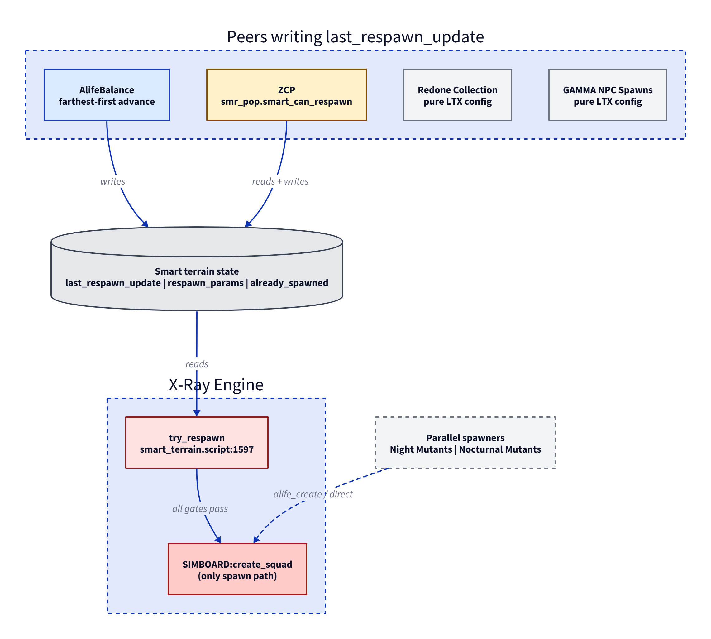
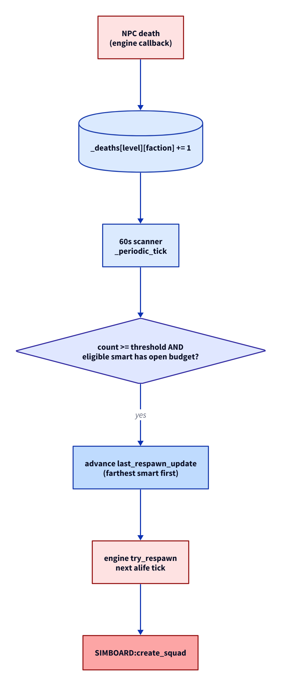

# AlifeBalance Architecture

AlifeBalance accelerates respawn at smart terrains whose recipes produce a faction the player has been killing. It counts deaths per (level, faction), and every 60 wall-seconds advances the `last_respawn_update` timestamp of eligible smarts backward, bringing the engine's own cooldown gate closer to expiry. The engine still owns the spawn itself, the recipe choice, the squad section, and the NPC count. AlifeBalance writes exactly one field: `last_respawn_update`.

Two MCM knobs: `advances` (1-8, default 4) sets how many advances drive one smart from full cooldown to the floor; `Min Minutes` (10-360, default 120) sets the floor on remaining cooldown that AlifeBalance never pushes below. With defaults, four advances of accumulated combat push one smart through, and the engine ages the final two game-hours on its own clock before firing `try_respawn`.

Built on xlibs. `_ab_deps` asserts the minimum xlibs version on load.



---

## The cooldown clock

Every smart terrain holds two engine fields that together define when it can spawn next:

- `respawn_idle` — cooldown duration in game-seconds. Set once from LTX (`smart_terrain.script:231`), per-smart. Vanilla LTX default 86400 (24 game hours); the engine code fallback for unset entries is 43200 (12h); ZCP under GAMMA is 21600 (6h); Redone varies. AlifeBalance only reads this field.
- `last_respawn_update` — timestamp of the smart's last spawn. The engine resets it to `curr_time` after every `SIMBOARD:create_squad`. AlifeBalance writes this field; one subtract per advance, in `_advance_smart` at `ab_pacing.script:267-281`.

The engine's cooldown gate at `smart_terrain.script:1651`:

```
elapsed         = curr_time - last_respawn_update
gate_open       = elapsed > respawn_idle
hours_remaining = respawn_idle - elapsed       (debug overlay reports this)
```

AlifeBalance brings the gate closer by aging `last_respawn_update` backward:

```
smart.last_respawn_update :sub( (respawn_idle - Min Minutes * 60) / advances seconds )
```

The cooldown duration (`respawn_idle`) never changes; only the timestamp does. The engine's `respawn_idle` setting remains the ground truth for cycle length.

Worked example at vanilla LTX `respawn_idle=86400`, MCM `advances=4`, `Min Minutes=120`:

```
respawn_idle         = 86400 s   = 24.0 game-hours
usable               = 79200 s   = 22.0 game-hours      (respawn_idle - Min Minutes*60)
per-advance subtract = 19800 s   =  5.5 game-hours      (usable / advances)
advances to floor    = 4
floor remaining      =  7200 s   =  2.0 game-hours      (engine ages this naturally)
```

Per-advance subtract scales with `respawn_idle`, so on shorter-cooldown modpacks each advance is a smaller game-time move while the kill cost stays the same:

| Scenario     | respawn_idle | usable | per-advance | floor |
|--------------|-------------:|-------:|------------:|------:|
| Vanilla LTX  |          24h |    22h |        5.5h |    2h |
| ZCP @ GAMMA  |           6h |     4h |          1h |    2h |

The picker's skip conditions in `_can_advance` (called per eligible smart per tick):

- **Degenerate config**: `usable <= 0` (when `Min Minutes * 60 >= respawn_idle`). Vanilla pace owns this smart.
- **Fresh smart**: `last_respawn_update == nil`. Engine cooldown gate is already open; no acceleration needed.
- **`advances >= 2`**: skip if a full advance push would overshoot the floor (`max_push < advance_seconds`). No clamping; the next tick can push again after natural ageing.
- **`advances == 1`**: skip if the smart is within 60 game-seconds of the floor. Precision-drift guard.

The picker sorts eligible smarts by actor-to-smart distance descending. Advances pile on the farthest qualifying smart until it hits the floor, then move to the next-farthest. This is a soft preference: if only near-actor smarts are eligible, they still receive advances, and the engine's own `respawn_radius` gate at `smart_terrain.script:1619` will defer the spawn until the actor moves out.

---

## Pipeline



```
DEATH (engine fires squad_on_npc_death)
  |
  v
_on_npc_death(squad, npc, killer)
  - if disabled: return
  - _stats.deaths += 1
  - if xsquad.is_protected:        _stats.protected += 1, return
  - if _is_vermin_squad (rat / tushkano): _stats.vermin += 1, return
  - faction  = squad.player_id
  - level_id = xlevel.get_level_id(npc or squad)
  - _stats.counted += 1
  - _deaths[level_id][faction] += 1

TICK (every 60 wall-seconds via CreateTimeEvent)
  |
  v
_periodic_tick()
  - for each (level_id, faction) in _deaths:
      smarts, threshold = ab_recipe.get_eligible_and_threshold(level_id, faction)
      if #smarts == 0:                              [NOELIG], no action
      else if count < threshold:                    [BELOW],  no action
      else:
        with_budget = filter smarts by _can_advance AND ab_recipe.evaluate_budget_for_faction
        if #with_budget == 0:                       [DEFER],  counter holds
        else:
          sort with_budget by actor->smart distance descending
          while count >= threshold and #with_budget > 0:
            smart = with_budget[1]                  (farthest from actor)
            smart.last_respawn_update:sub(params.delta)
            count -= threshold
            _stats.advances += 1                    [ADVANCE]
            if not _can_advance(smart):
              remove smart from with_budget
          by_faction[faction] = count               (leftover < threshold carries to next tick)
          if advances_this_tick > 1: log [BURST]

ENGINE (its own alife tick at the advanced smart)
  - se_smart_terrain:update -> try_respawn
  - cooldown gate (smart_terrain.script:1651): diff > respawn_idle ? proceed : skip
  - per-recipe budget gate (smart_terrain.script:1696)
  - picks recipe at random from open ones
  - picks squad section at random from recipe.squads
  - SIMBOARD:create_squad(smart, section)
  - sets squad.respawn_point_id = smart.id
  - increments already_spawned[k].num
  - writes last_respawn_update = curr_time
```

**Threshold** for a (level, faction) pair is the MAX `npc_in_squad` upper bound across all squad sections in eligible smarts' recipes that produce the faction. Cordon stalker = 3, Swamp boar = 15. Read from `squad_descr` LTX on first death, cached for the session. No MCM knob — engine-grounded by construction.

**Eligible smart**: a smart on the target level with at least one section in its `respawn_params` recipes whose `squad_descr faction` equals the target faction. Routing props are not checked; they govern where squads can move, not what recipes spawn.

**Open budget**: at least one matching recipe has `max > already_spawned[k].num` right now, where `max = xr_logic.pick_section_from_condlist(actor, smart, recipe.num)`.

---

## Engine gates inside try_respawn

`smart_terrain.script:1597-1762` has eight gates. AlifeBalance affects one.

| Gate                                          | Source line | Our effect |
|-----------------------------------------------|-------------|------------|
| Disabled / on_try_respawn callback            | 1603        | Untouched |
| Peace info                                    | 1607        | Untouched |
| Level filter (`respawn_only_level`)           | 1611        | Untouched |
| Actor distance (`respawn_radius`)             | 1619        | Untouched |
| `respawn_params and already_spawned` exist    | 1625        | Untouched |
| Simulation availability                       | 1630        | Untouched |
| Cooldown timer                                | 1651        | Subtract `(respawn_idle - Min Minutes*60) / advances` from `last_respawn_update` per advance |
| Per-recipe budget                             | 1696        | Untouched |

---

## Population invariant

For any (level, faction) pair, between consecutive engine spawns at any eligible smart for that pair, the engine refills no more NPCs of that faction than have died on that level.

*Proof*: each advance fires only after the counter reaches `threshold = MAX npc_in_squad` across matching sections, and the picker rejects smarts already at the floor. Total deaths between consecutive spawns at a smart `>= applied_advances * threshold`. The spawn creates at most one squad; if the engine picks a matching section, that squad contains at most `MAX npc_in_squad` NPCs of the target faction; if it picks a non-matching section in a mixed pool, zero. Either way `deaths >= MAX >= refill`. ∎

The vanilla cooldown ages from game-time alone. If the player ignores a level, no deaths fire, no advances apply, and the engine spawns at vanilla pace after `respawn_idle` of game-time. AlifeBalance accelerates the cooldown; it never delays vanilla.

---

## Design rationale: why advance, not clear

Setting `last_respawn_update = nil` bypasses the cooldown gate entirely — the engine fires on its next alife tick. "Combat happened" becomes "spawn now," with no middle ground; combat intensity stops mattering once threshold is crossed once.

Per-advance subtract keeps the gate engaged. Each advance is a small constant push, and sustained combat produces sustained refill. Burst combat that crosses threshold once produces `1 / advances` of a cycle; the vanilla cooldown ages out the rest naturally if combat stops. The pacing matches death rate without overriding the engine's own gate.

The `Min Minutes` floor guarantees the engine fires the last leg on its own clock. AlifeBalance pushes closer but never to expiry; from the floor the engine's natural ageing closes the gap and `try_respawn` runs from the engine's clock, not ours. The picker drops smarts whose age would cross the floor on the next advance, so the floor is a hard guarantee, not a soft target.

---

## State and callbacks

Owned state, all in-memory, reset on game load:

| Owner      | State                                | Purpose |
|------------|--------------------------------------|---------|
| ab_pacing  | `_deaths[level_id][faction]`         | death counter per pair, decremented by threshold per advance |
| ab_recipe  | `_eligible[level_id][faction]`       | cached eligible smarts, recipe-content derived, static for the session |
| ab_recipe  | `_thresholds[level_id][faction]`     | cached MAX `npc_in_squad` across matching sections |
| ab_pacing  | `_delta_cache[smart_id]`             | cached `{ delta, advance, max_age }`, invalidated on MCM change or reset |
| ab_pacing  | `_smart_stats[smart_id]`             | per-smart advance bookkeeping for the right-click "Show stats" tip |
| ab_pacing  | `_seen_squads[squad.id]`             | dedup set for spawn tracing (DEBUG only) |
| ab_map     | `_markers[smart_id]`                 | linger expiry per marked smart |
| ab_pacing  | `_stats`                             | 11 diagnostic counters (deaths, counted, protected, vermin, ticks, advances, spawns, etc.) |

Callbacks: `squad_on_npc_death`, `squad_on_npc_creation`, `on_option_change`, `load_state`, `actor_on_first_update`, `map_spot_menu_add_property`, `map_spot_menu_property_clicked`. One `CreateTimeEvent` timer at 60-second wall interval.

No persistence for AlifeBalance state. Advanced `last_respawn_update` values survive in the engine's own save data via `utils_data.w_CTime / r_CTime`.

Not owned by AlifeBalance: which recipe the engine picks (random over open-budget), which squad section within that recipe (random), NPC count within `npc_in_squad` range (random), ZCP `smr_handle_spawn` substitution, online cap enforcement (GAMMA Dynamic Despawner, AlifeGuard).

---

## Files

| File | Purpose |
|------|---------|
| `gamedata/scripts/_ab_deps.script` | Version string, xlibs dependency gate |
| `gamedata/scripts/ab_mcm.script` | MCM defaults, UI definition, button handlers |
| `gamedata/scripts/ab_pacing.script` | Death handler, periodic tick burst-advance loop, per-smart CTime delta cache, `_advance_smart` cooldown subtract, public `marker_label` + `show_smart_stats` for ab_map |
| `gamedata/scripts/ab_recipe.script` | Per-(level, faction) eligibility + threshold cache, single-pass budget evaluation. Two entry points called by ab_pacing: `get_eligible_and_threshold` and `evaluate_budget_for_faction`. Delegates smart discovery and squad-size lookup to xsmart. |
| `gamedata/scripts/ab_map.script` | PDA marker render-state, right-click menu (teleport, show stats). Calls back into ab_pacing for label + stats formatting. |
| `gamedata/scripts/ab_test.script` | Console-driven test harness. Fires fake NPC deaths every 3s, alternating on-level / off-level pools. Same protection + vermin filters as ab_pacing. |
| `gamedata/configs/text/eng/ui_st_mcm_ab.xml` | MCM strings (English) |
| `gamedata/configs/text/rus/ui_st_mcm_ab.xml` | MCM strings (Russian) |
| `gamedata/textures/ab_mcm_banner.dds` | MCM banner (512x50) |

---

## MCM

| Setting              | Tab         | Section       | Type   | Default | Range   | Effect |
|----------------------|-------------|---------------|--------|---------|---------|--------|
| `enabled`            | General     | Smart Pacing  | check  | true    | -       | Master toggle |
| `advances`           | General     | Smart Pacing  | track  | 4       | 1-8     | Per-advance subtract is `(respawn_idle - Min Minutes*60) / advances` |
| `Min Minutes`        | General     | Smart Pacing  | track  | 120     | 10-360  | Minimum cooldown remaining after every advance, in game minutes |
| `log_level`          | Development | Logging       | list   | WARN    | -       | ERROR / WARN / INFO / DEBUG |
| `show_markers`       | Development | Diagnostics   | check  | false   | -       | Green PDA marker on every advanced smart, 5-min linger, right-click teleport / stats |
| `btn_show_status`    | Development | Diagnostics   | button | -       | -       | PDA tip with death / counted / protected / vermin / tick / advance / spawn counters |
| `btn_reset_counters` | Development | Diagnostics   | button | -       | -       | Clears `_deaths`, `_delta_cache`, `_smart_stats`, `_seen_squads`, `_stats`, ab_recipe caches, and all markers |

Threshold has no knob — it is engine-grounded, read from `squad_descr` LTX per (level, faction) and cached.

---

## Performance

| Operation | Cost |
|-----------|------|
| Per death | O(1). Protection check, vermin species lookup (cached), faction read, level lookup, counter increment. |
| `ab_recipe.get_eligible_and_threshold`, first call per pair | O(S * R * Q) over smarts on level * recipes per smart * sections per recipe. 2 luabind `ini_sys:r_string_ex` per section. Cached. |
| `ab_recipe.get_eligible_and_threshold`, cache hit | O(1) |
| `ab_recipe.evaluate_budget_for_faction`, per tick per eligible smart | O(R * Q) over recipes * sections. 1 `pick_section_from_condlist` per recipe + 1 `ini_sys:r_string_ex` per section until first faction match. |
| `_get_advance_params`, first call per smart | 2 CTime constructions + 2 `setHMSms` + 1 operator-. ~5 luabind. Cached. |
| `_get_advance_params`, cache hit | O(1) |
| `_can_advance`, per tick per eligible smart | 1 luabind: `xtime.game_time():diffSec(lru)`. |
| Per advance | 3 luabind: `last_respawn_update` read, `:sub` with cached delta, write back. |
| Per tick (60s) | O(L * F) over death pairs * O(E * R * Q) budget evaluation per pair, plus one-time computes per new pair or new smart. |

---

## Compatibility

| Mod | Interaction |
|-----|-------------|
| Vanilla `try_respawn` | Reads `last_respawn_update` at `smart_terrain.script:1651`. The advance moves the same field. |
| ZCP (forked `try_respawn`) | Reads the same field at `smr_pop.script:342-368`, applies its own MCM cooldown. The advance applies identically; the per-advance subtract is sized at `smart.respawn_idle / advances`, so under shorter ZCP cooldowns each advance covers a smaller fraction of the gate. The `Min Minutes` floor still holds. |
| ZCP `smr_handle_spawn` | Substitutes the squad section in flight. Replacement still gets `respawn_point_id` and `respawn_point_prop_section` set, so engine budget accounting stays intact. AlifeBalance has no opinion on the substitution. |
| Redone Collection | Pure LTX configuration. AlifeBalance writes runtime state. No conflict. |
| GAMMA NPC Spawns | Pure LTX. No conflict. |
| Night Mutants | Parallel `SIMBOARD:create_squad` path. Spawned squads still get `respawn_point_id` set. No conflict. |
| Nocturnal Mutants | Raw `alife_create`. Bypasses smart terrains entirely. Independent. |
| GAMMA Dynamic Despawner | Enforces online cap on the despawning side. Despawn does not fire `squad_on_npc_death`. No false advances. |
| AlifeGuard | Squad-aware despawner. Same: despawn is not death. |
| AlifePlus | Reactive A-Life framework. Different fields and patterns. No overlap. |
| Warfare | `faction_controlled` smarts (16 of ~490) have an injected `respawn_params` entry whose `.squads` field is the vanilla `squads_by_faction[faction]` list. `xsmart.section_faction` reads those vanilla sections normally. Works. |
